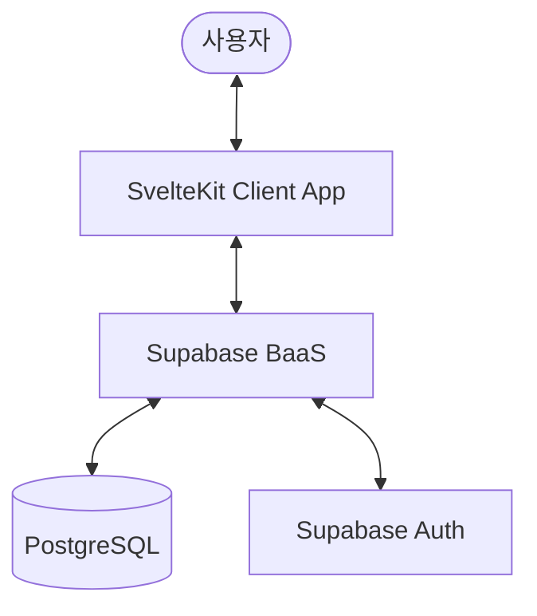

# Architecture: FX-Tracker

## 1. System Overview
FX-Tracker는 사용자 중심의 경량 웹 애플리케이션으로, Supabase를 중앙 허브로 사용하여 PC와 모바일 간의 실시간 데이터 동기화를 유지하는 구조입니다.

## 2. Tech Stack Summary
- **Frontend**: SvelteKit, Svelte, CSS
- **Backend/DB**: Supabase (PostgreSQL)
- **Deployment**: Vercel

## 3. Data Model (Entity-Relationship)

### `contracts` 테이블 (계약 내역)
| Column | Type | Description |
| :--- | :--- | :--- |
| id | UUID | 기본 키 (Primary Key) |
| user_id | UUID | 작성자 ID (FK to auth.users) |
| platform | String | 플랫폼 (토스, 스위치원, 카뱅 등) |
| buy_price | Decimal | 실제 매수 환율 (체결가) |
| sell_price | Decimal | 실제 매도 환율 (종료 시 체결가) |
| target_price | Decimal | 목표 매도 환율 (매도 주문 시 기준) |
| grid_gap | Decimal | 그리드 간격 (차수별 매수가 차이) |
| next_buy_price | Decimal | 다음 차수 매수 예정가 (자동 산출) |
| quantity | Decimal | 거래 수량 (외화 기준) |
| status | Enum | 상태 (BUY_ORDER, SELL_ORDER, COMPLETED) |
| created_at | Timestamp | 생성 일시 |
| updated_at | Timestamp | 수정 일시 |

## 4. Core Modules & Components

### A. Dashboard Module
- **Summary Header**: 총 자산 현황 산출 (보유 자산, 운용 자산, 실현 수익/기대 수익 계산 로직 포함)
- **Active Tracker**: 현재 `BUY_ORDER`, `SELL_ORDER` 상태인 계약들을 카드 형태로 노출.

### B. Transaction Module
- **Action Buttons**: '매도완료', '매수체결', '취소' 등의 상태 전환 로직 처리.
- **Quick Entry**: 빠른 거래 추가를 위한 간결한 입력 폼 UI.
- **Grid Calculator**: 현재 매수가 입력 시 `grid_gap`을 적용하여 `next_buy_price`를 자동 제안/기록하는 로직.

### C. History Module
- **Data Manager**: 전수 거래 내역 그리드 뷰 및 필터링(플랫폼별, 기간별, 상태별).

## 5. Data Flow (Status Transition)
1. 사용자가 거래 추가 -> `contracts` (status: BUY_ORDER) 생성. (UI: 매수 주문)
2. 매수 체결 확인 시 -> `status`를 SELL_ORDER로 업데이트. (UI: 매도 주문 - 보유 중이나 목표가 대기 중임을 의미)
3. 목표가 도달/매도 실제 완료 시 -> `status`를 COMPLETED로 업데이트. (UI: 종료)
4. 모든 상태 변경은 Supabase 실시간 구독(Realtime)을 통해 모든 디바이스에 즉시 반영.

## 6. Constraints & Guidelines
- **Responsive Design**: 모바일 세로 뷰 최우선 설계 (Viewport 360px 기준).
- **Performance**: 대시보드 로딩 시간 1초 미만 유지.
- **Security**: Supabase RLS(Row Level Security)를 설정하여 본인의 데이터만 접근 가능하도록 보장.
